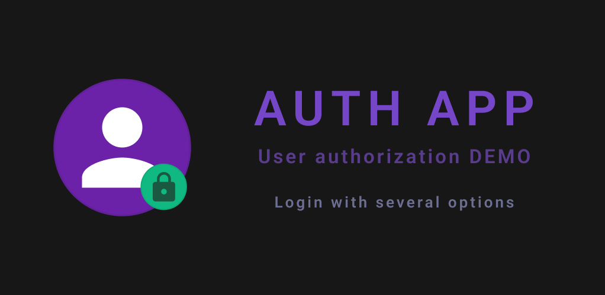
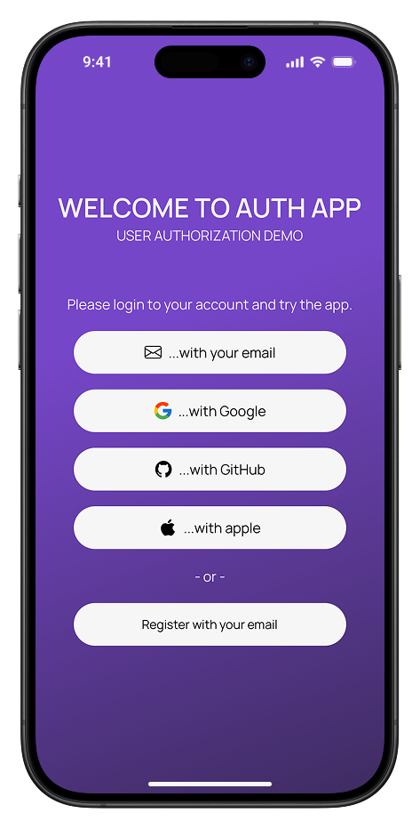
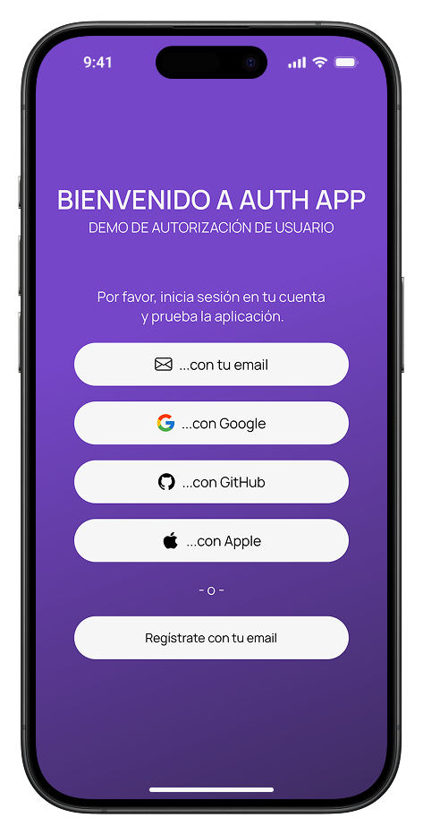
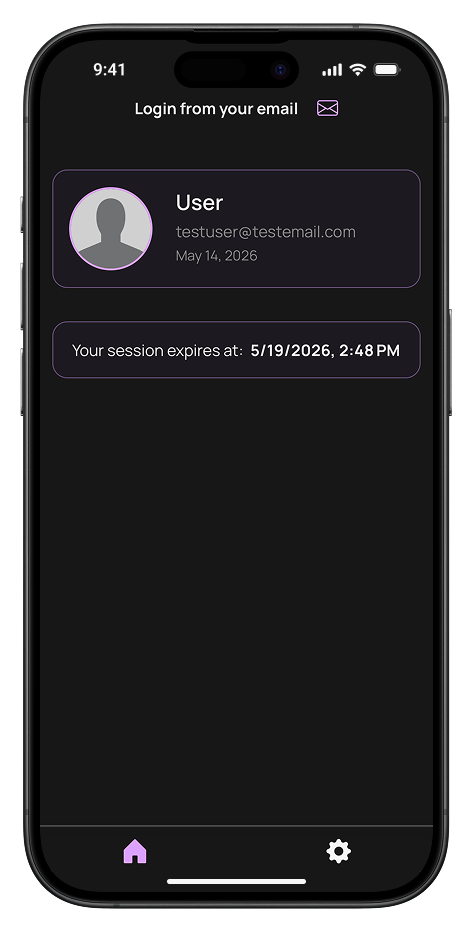
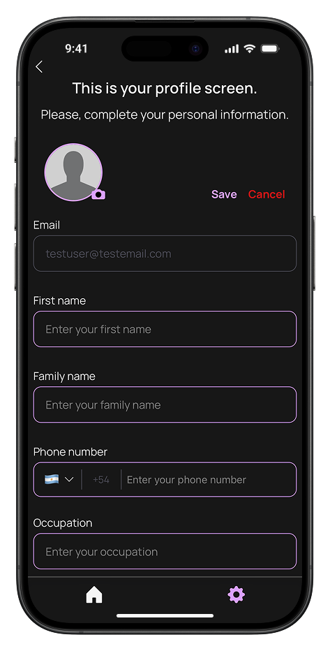
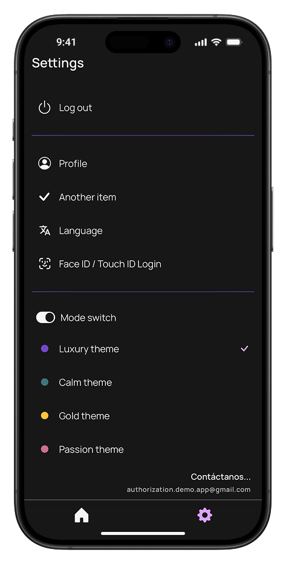
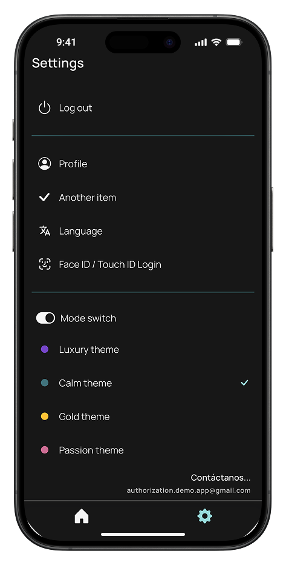
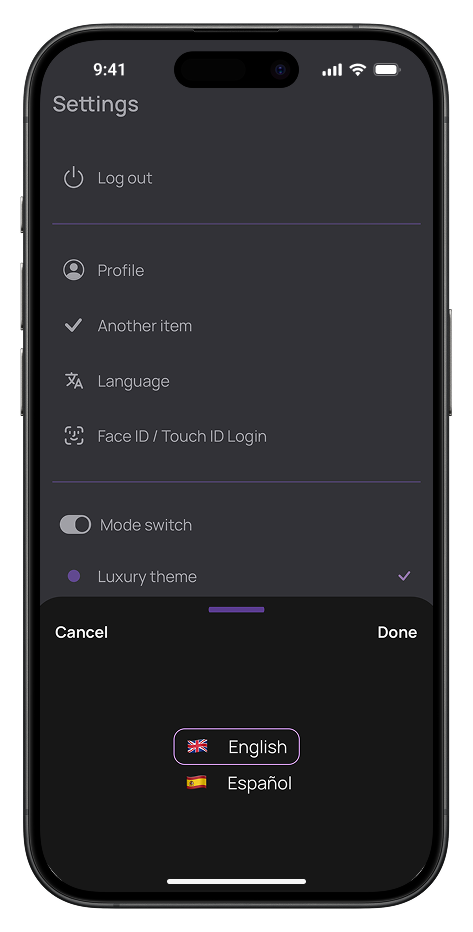
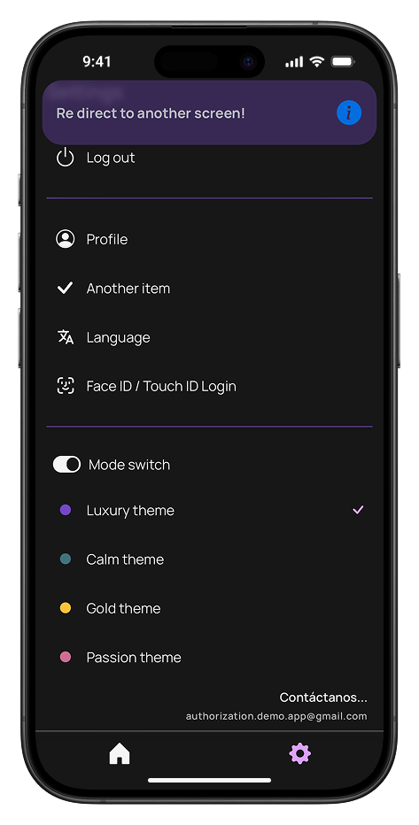

<div align="center">
  
</div>

# Auth App

> Secure. Fast. Seamless.

A full-featured authentication demo for iOS and Android built with React Native. Google, GitHub, and Apple Sign-In, biometric login (Face ID / Touch ID), JWT token management with silent refresh, push notifications, deep linking, and a multi-theme UI — all backed by a live REST API.

---

## Screenshots

<table>
  <tr>
    <td align="center"><br/><sub>Welcome — English</sub></td>
    <td align="center"><br/><sub>Welcome — Español</sub></td>
    <td align="center"><br/><sub>Home</sub></td>
  </tr>
  <tr>
    <td align="center"><br/><sub>Profile</sub></td>
    <td align="center"><br/><sub>Settings — Luxury theme</sub></td>
    <td align="center"><br/><sub>Settings — Calm theme</sub></td>
  </tr>
  <tr>
    <td align="center"><br/><sub>Language selector</sub></td>
    <td align="center"><br/><sub>Notification banner</sub></td>
    <td></td>
  </tr>
</table>

---

## Features

- **Google Sign-In** — OAuth 2.0 via `@react-native-google-signin/google-signin`
- **GitHub Sign-In** — OAuth 2.0 with PKCE via `react-native-app-auth` (no client secret stored)
- **Apple Sign-In** — Sign in with Apple (iOS only) via `@invertase/react-native-apple-authentication`
- **Biometric login** — Face ID / Touch ID opt-in flow; access-controlled Keychain entry invalidated on new biometric enrollment
- **JWT token management** — access + refresh token pair; silent proactive refresh when token expires within 5 minutes
- **Auto token refresh interceptor** — Axios request/response interceptor with deduplication; all concurrent requests share a single refresh call
- **Rate limiting** — persistent rate limiter (AsyncStorage-backed) on login, sign-up, and password reset; exponential backoff up to 15 min lockout
- **SSL pinning** — public-key pinning via `react-native-ssl-public-key-pinning` initialised at app startup
- **Push notifications** — Firebase Cloud Messaging; handles foreground, background, and quit-state messages
- **Deep linking** — custom scheme (`authapp://`) and HTTPS universal links for password reset flow
- **Multi-theme UI** — 4 color themes (Luxury, Calm, Gold, Passion) × dark/light mode; persisted to Keychain
- **i18n** — English and Spanish via `react-i18next`; language preference persisted to Keychain
- **Responsive layout** — pixel-perfect scaling based on 393×852 design reference; portrait-locked on all platforms
- **Input sanitisation** — XSS prevention on all user-provided data before API calls

---

## Tech Stack

| Layer | Technology |
|---|---|
| Framework | React Native 0.82 (bare CLI) |
| Language | TypeScript 5.8 (strict mode) |
| Navigation | React Navigation 7 — Stack + Bottom Tab |
| State | Redux Toolkit 2 + Redux Thunk |
| HTTP | Axios + custom interceptor |
| Auth (OAuth) | Google Sign-In, react-native-app-auth (GitHub PKCE), Apple Authentication |
| Secure storage | react-native-keychain (Keychain / Android Keystore) |
| Push notifications | Firebase Cloud Messaging (`@react-native-firebase`) |
| Animations | React Native Reanimated 4 |
| Gestures | React Native Gesture Handler |
| i18n | react-i18next |
| Testing | Jest 29 + React Native Testing Library 13 |

---

## Architecture

### Authentication flow

```
App launch
  └─ SplashScreen
       ├─ Biometric enabled? → Face ID / Touch ID prompt → validateRefreshToken → Home
       ├─ Remember Me set?   → validateRefreshToken → Home
       └─ Neither            → WelcomeScreen → manual login

Login success
  └─ checkAndOfferBiometric()
       ├─ Device has biometrics + not enabled + not declined? → BiometricOptInModal
       │     ├─ Enable  → enableBiometricLogin() → Home
       │     └─ Not Now → markBiometricDeclined() → Home (never asked again)
       └─ Otherwise → Home directly
```

### Token refresh interceptor

The Axios interceptor in `src/store/apiInterceptor.ts` handles two cases:

- **Request interceptor** — proactively refreshes the access token if it expires within 5 minutes. Skips auth endpoints (`/login`, `/token/refresh`, etc.) to prevent loops.
- **Response interceptor** — catches 401 responses and retries the original request once with a freshly refreshed token.
- **Deduplication** — a shared `refreshTokenPromise` ensures concurrent requests all await the same single refresh call rather than triggering multiple refreshes.
- **Logout on failure** — if the refresh token is missing or the refresh call fails, Keychain is cleared and the user is returned to WelcomeScreen.

### Secure storage

All sensitive data is stored via `react-native-keychain` using named service keys (`KeychainService` enum). Key entries:

| Service | Accessibility | Notes |
|---|---|---|
| `REFRESH_TOKEN` | `WHEN_UNLOCKED_THIS_DEVICE_ONLY` | Cleared on logout |
| `BIOMETRIC_LOGIN` | `BIOMETRY_CURRENT_SET` + access control | Invalidated on new biometric enrollment |
| `BIOMETRIC_DECLINED` | `AFTER_FIRST_UNLOCK` | Never cleared on logout — respects permanent opt-out |
| `MODE` / `THEME` / `LANGUAGE` | `AFTER_FIRST_UNLOCK` | UI preferences, survive logout |

### State management

Single Redux slice (`authSlice`) with async thunks split by domain:

```
src/store/
  authSlice.ts          # isAuthorized, token, user, loader, notifications
  thunks/
    authThunks.ts       # validateRefreshToken, loginUser, createUser, logoutUser
    userThunks.ts       # editUser
    passwordThunks.ts   # reset password flow
  otherAuthHooks.ts     # Google, GitHub, Apple Sign-In thunks
  apiService.ts         # Axios instance
  apiInterceptor.ts     # Token refresh logic
```

---

## Project structure

```
src/
  assets/         # Images, SVG icons, fonts, screenshots
  components/     # Reusable UI — buttons, inputs, modals, splash, notifications
  constants/      # Colors (4 themes), dimensions, scaling utilities
  context/        # ModeContext — theme + dark/light mode provider
  hooks/          # useBiometricAuth, useCheckToken, useLogoutUser
  locale/         # i18n translations (en, es)
  navigation/     # RootNavigation, AuthNavigator, HomeNavigator, types
  screens/
    auth/         # WelcomeScreen, LoginScreen, CheckEmailScreen, NewPasswordScreen
    home/         # HomeScreen
    settings/     # SettingsScreen, ProfileScreen
  store/          # Redux store, slices, thunks, API layer
  utils/          # secureStorage, biometricAuth, errorHandler, validationHelper,
                  # cleanUserData, persistentRateLimiter, sslPinning, notifications
```

---

## Getting started

### Prerequisites

- Node.js 20+
- Ruby + Bundler (iOS)
- Xcode 15+ (iOS)
- Android Studio + JDK 17 (Android)
- `GoogleService-Info.plist` (iOS) and `google-services.json` (Android) from Firebase Console

### Install

```bash
npm install
```

### iOS setup

```bash
cd ios
bundle install
bundle exec pod install
cd ..
```

### Run

```bash
npm start                  # Metro bundler
npm run ios                # iOS Simulator
npm run android            # Android Emulator
npm run start-cache        # Metro with cache reset
```

### Test

```bash
npm test
```

### Lint

```bash
npm run lint
```

---

## Security highlights

- **No client secrets in the app** — GitHub OAuth uses PKCE; no `clientSecret` is stored anywhere in the codebase
- **SSL pinning** — active on all API calls via `react-native-ssl-public-key-pinning`
- **Biometric entry invalidation** — `BIOMETRY_CURRENT_SET` access control means a new fingerprint or face enrollment automatically invalidates the stored credential
- **XSS prevention** — `sanitizeUserInput()` and `cleanUserData()` applied to all user input before API calls
- **Rate limiting** — brute-force protection on login (5 attempts, exponential backoff, max 15 min lockout)
- **Token storage** — refresh token stored with `WHEN_UNLOCKED_THIS_DEVICE_ONLY`; never in AsyncStorage or plain files

---

## Platform support

| Platform | Minimum version |
|---|---|
| iOS | 15.1 |
| Android | 7.0 (API 24) |

---

## Backend

The REST API powering this app is a separate project built with **Node.js + TypeScript + Express 5**.

- **Repo:** [RN_authApp_BE](https://github.com/JuanEduardoCastro/RN_authApp_BE)
- **Live API:** `https://api.authdemoapp-jec.com`
- **Stack:** Node.js · TypeScript · Express 5 · MongoDB + Mongoose · JWT · bcrypt
- **Handles:**
  - JWT issuance + refresh token rotation (`/token/refresh`)
  - Google, GitHub, and Apple OAuth token exchange
  - User management (create, edit, password reset)
  - Transactional email via SendGrid (password reset flow)
  - FCM device token management + push notification dispatch via Firebase Admin

---

## Privacy & Legal

- [Privacy Policy](docs/app-privacy-policy.html)
- [Terms & Conditions](docs/app-terms-&-conditions.html)

---

## License

MIT
