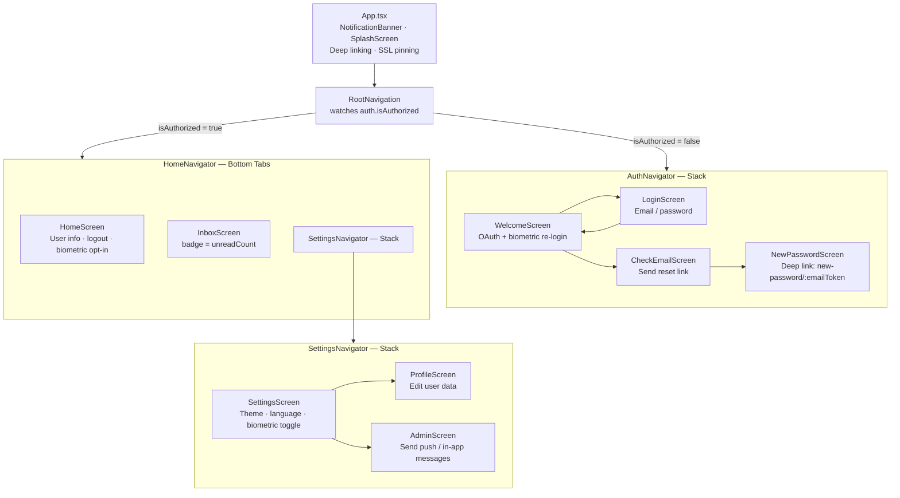
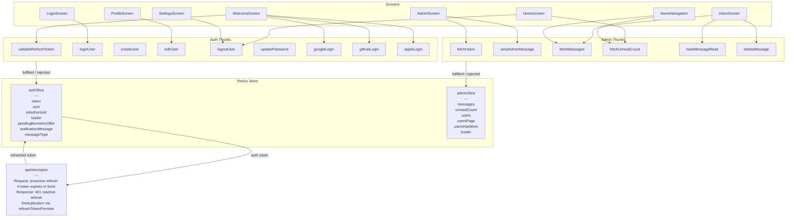
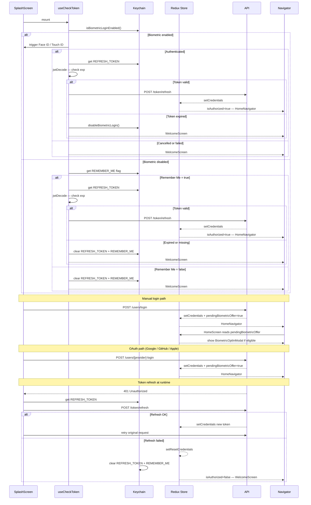
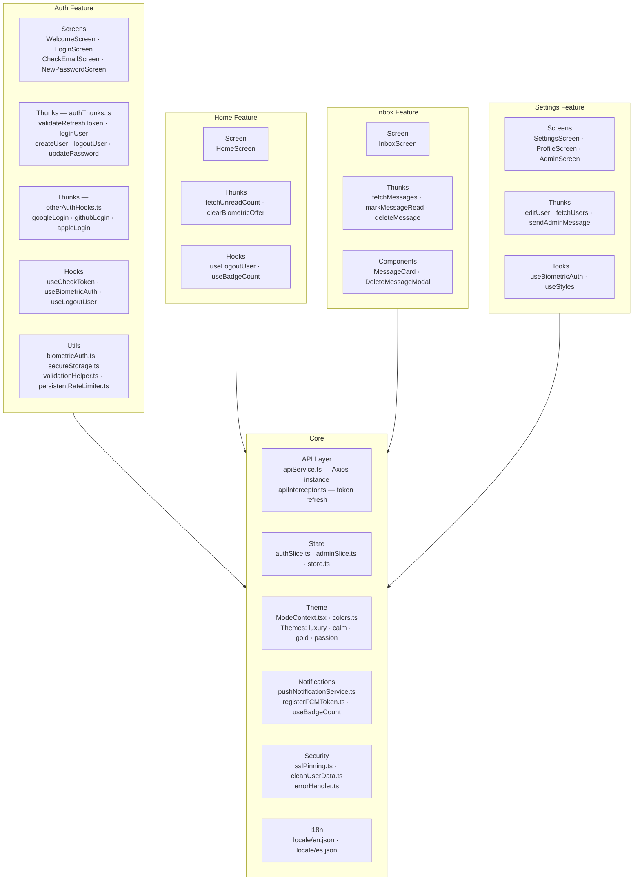

# RN_authApp — Architecture

React Native 0.82.0 · TypeScript · Redux Toolkit · React Navigation 7

---

## 1. Navigation Hierarchy

---

## 2. Redux State and Data Flow

---

## 3. Authentication Flow

---

## 4. Feature Map

---

## Key Invariants

| Rule | Where enforced |
|---|---|
| Never use raw strings for Keychain service names | `KeychainService` enum in `secureStorage.ts` |
| No default `Authorization` header on Axios | Every authenticated thunk passes it manually |
| `BIOMETRIC_DECLINED` never cleared on logout | Excluded from `logoutUser` cleanup — respects permanent opt-out |
| 401 refresh calls deduplicated | `refreshTokenPromise` singleton in `apiInterceptor.ts` |
| Biometric opt-in shown only after `HomeScreen` mounts | `pendingBiometricOffer` Redux flag — set on login, consumed in `HomeScreen` |
| Token refresh skipped for public endpoints | `skipValidation` list in request interceptor |
| All `console.log` wrapped in `__DEV__ &&` | Never leave bare logs in production |
| Paginated responses shape: `{ data: [], pagination: {} }` | All list endpoints — `data` is the array directly |
